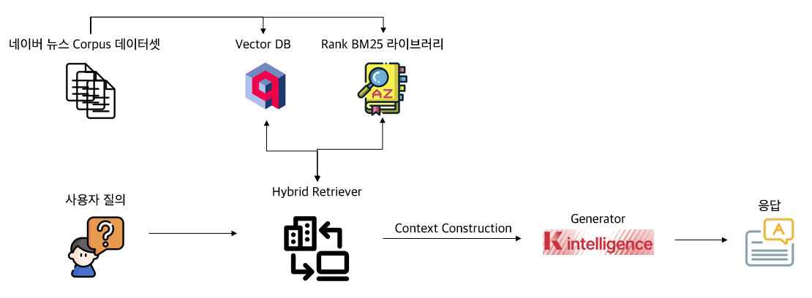

# RAG Pipeline Project

한국어 뉴스 데이터를 기반으로 한 Retrieval-Augmented Generation (RAG) 시스템 구현 프로젝트입니다.

## 📋 개요


이 프로젝트는 대규모 언어 모델(LLM)을 활용하여 뉴스 기사에서 자동으로 질문-답변 쌍을 생성하고, 검색 기능을 포함한 완전한 RAG 파이프라인을 구축합니다.

### 주요 기능
- 🔍 **문서 검색**: BM25 및 Dense Embedding 기반 하이브리드 검색
- 🤖 **QA 생성**: 다양한 LLM을 활용한 자동 질문-답변 쌍 생성
- 📊 **평가 시스템**: 생성된 QA 쌍의 품질 평가
- 💾 **Hybrid Retrieval**: Qdrant 기반 임베딩 저장 및 검색, BM25 기반 Sparse retriever의 혼합 retrieval

---

## 🗂️ 프로젝트 구조

```
final_project/
├── pipeline/              # 핵심 파이프라인 모듈
│   ├── chain/            # RAG 파이프라인을 RAGChain 객체로 서빙
│   ├── dataset/          # 데이터셋 관리
│   ├── generator/        # LLM 기반 생성기
│   ├── retriever/        # 검색 모듈
│   ├── eval/             # 평가 로직
│   ├── qdrant/           # 벡터 DB 연동
│   └── common.py         # 공통 유틸리티
├── scripts/              # 실행 스크립트
│   ├── newsqa_rag.py     # RAG 파이프라인 실행
│   ├── eval_generation.py # 생성 평가
│   ├── eval_retrieval.py  # 검색 평가
│   └── *.sh              # 배시 스크립트
├── notebooks/            # Jupyter 노트북(실제 개발 시 활용했던 notebook files)
│   ├── 001_dataset.ipynb
│   ├── 002_qa.ipynb
│   ├── 003_retrieval.ipynb
│   ├── 004_vllm.ipynb
│   └── ...
├── qa/                   # QA 데이터 및 생성 스크립트
│   ├── newsqa.json       # 네이버 뉴스 기사 corpus에서 생성한 qa 데이터(NewsQA)
│   └── qa_generation.py  # NewsQA 생성 코드(유료 OpenAI api 필요)
├── outputs/              # RAG로 생성된 결과물 (자동생성)
│   ├── geneval/          # 생성 평가를 위한 폴더로, RAG로 생성된 .json 파일을 복사해서 넣어주기
│   ├── releval/          # 검색 평가를 위한 폴더로, RAG로 생성된 .json 파일을 복사해서 넣어주기
│   └── *.json            # 생성된 답변 및 검색 결과 파일
├── logs/                 # 실행 로그 (자동생성)
├── service.ipynb         # Gradio를 통한 PoC 프로덕트
├── keys.py               # API 키 설정 (직접 생성 필요)
└── README.md            # 이 파일
```

---

## 🚀 설치 및 준비

### 필수 요구사항
- Python 3.10
- CUDA 지원 GPU (권장)
- pip 또는 conda

### 의존성 설치
- setup.sh 파일 참조

### API 키 설정
`keys.py` 파일에 다음을 설정하세요:
- **Qdrant**: 벡터 DB URL 및 API 키
- **OpenAI**: API 키 (생성 모델 사용 시)

```python
# keys.py
QDRANT_URL = "your_qdrant_url"
QDRANT_API_KEY = "your_api_key"
OPENAI_API_KEY = "your_openai_key"
```

---

## 🎯 사용 방법

### 1. vLLM 모델 서빙

아래는 vLLM으로 모델을 서빙하는 예시입니다. Generation을 위한 모델은 embedder 여유 공간 확보를 위해 gpu utilization을 0.7로, LLMeval을 위한 Qwen 7B 모델은 0.9로 설정하는 것을 권장합니다.

#### LG AI (EXAONE 1.2B)
```bash
vllm serve LGAI-EXAONE/EXAONE-4.0-1.2B --port 8000 --gpu-memory-utilization 0.7
```

#### KT (Midm 2.0 Mini Instruct)
```bash
vllm serve K-intelligence/Midm-2.0-Mini-Instruct --port 8000 --gpu-memory-utilization 0.7
```

#### NAVER (HyperCLOVAX SEED Text Instruct 1.5B)
```bash
vllm serve naver-hyperclovax/HyperCLOVAX-SEED-Text-Instruct-1.5B --port 8000 --gpu-memory-utilization 0.7
```

#### Qwen2.5-7B
```bash
vllm serve Qwen/Qwen2.5-7B-Instruct --port 8000 --gpu-memory-utilization 0.9 --max-model-len 8192
```

### 2. Qdrant 벡터 DB 준비

```bash
# Qdrant 컬렉션 생성
python scripts/create_collection.py

# 또는 배시 스크립트 사용
bash scripts/bge_collection_create.sh
```

### 3. QA 쌍 생성

```bash
# Python 스크립트로 생성
python qa/qa_generation.py --model-name gpt-4o

# 또는 배시 스크립트 사용
bash scripts/generate_newsqa.sh
```

### 4. RAG 파이프라인 실행

```bash
# 메인 RAG 파이프라인
python scripts/newsqa_rag.py

# 또는 배시 스크립트
bash scripts/newsqa_rag.sh
```

### 5. 평가 수행

```bash
# 생성 품질 평가
python scripts/eval_generation.py

# 검색 품질 평가
python scripts/eval_retrieval.py

# 모든 평가 실행
bash scripts/eval_all.sh
```

---

## 📊 주요 컴포넌트

### Generator
- **OpenAIGenerator**: GPT 모델을 활용한 QA 생성
- **VLLMGenerator**: vllm 서빙을 통한 llm 모델
- **PromptGenerator**: 다양한 상황에 필요한 prompt를 구성

### Retriever
- **BM25**: 전통적인 키워드 기반 검색
- **Dense Retriever**: 임베딩 기반 의미론적 검색
- **Hybrid Search**: BM25와 Dense 검색 결합

### Evaluator
- **생성 평가**: LLM evaluation 지표 계산
- **검색 평가**: Recall, nDCG, LLM evaluation 지표 계산
- **상세 로깅**: 각 task별 로그 기록

### Dataset
- **NewsQA**: 뉴스 기사 기반 QA 데이터셋

---

## 👥 기여자

서울대학교 산업공학과 25-2 산업텍스트애널리틱스 기말 Term Project

공과대학 산업공학과 20학번 윤승혁
 